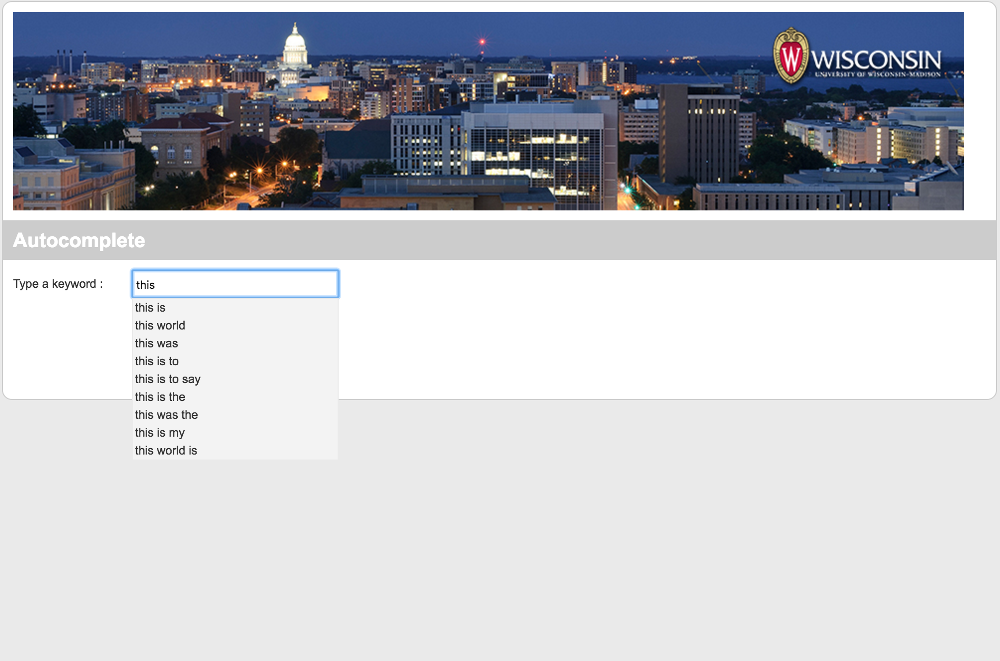

# Google Search Auto Complete

## Overview
In this project, I implemented google search auto complete based on N-Gram Model using Hadoop MapReduce in Java.

## Step

* Build N-Gram Library from input.
* Build Language Model based on N-Gram Library and probability.
* Load the data of Language Model into MySQL.
* Utilize JQuery, PHP, Ajx to build auto-complete in web demo.

## Demo

Here is how my auto-complete look likes.



## How to run

I deployed a hadoop cluster on Docker, which has one namenode and two datanodes, and tested my program on it.

Before you runs the program, please deploy you AMP stack (Apache, MySQL, PHP) and grant all privileges to the localhost and hadoop cluster on the output table in MySQL.

```
$ hadoop com.sun.tools.javac.Main *.java
$ jar cf ngram.jar *.class
$ hadoop jar ngram.jar Driver input /output 2 3 4 
```

* args0: input path
* args1: output path
* args2: ngram size
* args3: threshold size, it would be ignored if the count of the word's occurrence smaller than threshold. 
* args4: following word size


